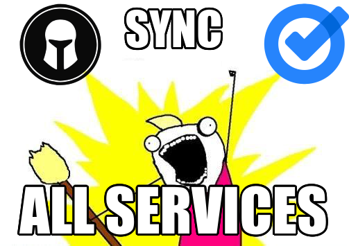
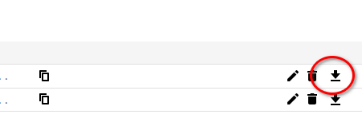

# [Taskwarrior](https://taskwarrior.org/) ⬄ [Google Tasks](https://support.google.com/tasks/answer/7675772)



## Description

Given all tasks in your Google Task task list and the task list of a Taskwarrior
_filter_ (combination of tags and projects) synchronise all the addition /
modification / deletion events between them.

## Demo - populating a list in Google Tasks (view from Google Calendar)


## Motivation

While Taskwarrior is an excellent tool when it comes to keeping TODO lists,
keeping track of project goals etc., lacks the portability, simplicity and
minimalistic design of Google Tasks. The latter also has the following
advantages:

- Automatic sync across all your devices
- Comfortable addition/modification of events using voice commands
- Actual reminding of events with a variety of mechanisms

## Override Google Tasks API key

At the moment the Google Console app that makes use of the Google Tasks API is
still in Testing mode and awaiting approval from Google. This means that if it
raches more than 100 users, the integration may stop working for you. In that
case in order to use this integration you will have to register for your own
developer account with the Google Tasks API with the following steps:

Firstly, remove the `~/.gtasks_credentials.pickle` file on your system since
that will be reused if found by the app.

For creating your own Google Cloud Developer App:

- Go to the [Google Cloud developer console](tw-gtasks-integration-test)
- Make a new project
- From the sidebar go to `API & Services` and once there click the `ENABLE APIS AND SERVICES` button
- Look for and Enable the `Tasks API`

Your newly created app now has access to the Tasks API. We now have to create
and download the credentials:

- Again, from the sidebar under `API And Services` click `Credentials`
- In the Google Tasks API screen, click the `CREATE CREDENTIALS` button.
- Select the `User data` radio button (not the `Application data`).
- Fill in the `OAuth Consent Screen` information (shouldn't affect the process)
- Allow the said credentials to access the following scopes:
  - `Create, edit, organize, and delete all your tasks`
  - `View your tasks`
- Create a new `OAuth Client ID`. Set the type to `Desktop App` (app name is not
  important).
- Finally download the credentials in JSON form by clicking the download button
  as shown below. This is the file you need to point to when running
  `tw_gtasks_sync`.

  

To specify your custom credentials JSON file use the `--google-secret` flag as follows:

```sh
tw_gtasks_sync -l "<list-name>" -t "<taskwarrior-tag>" --google-secret "<path/to/downloaded/json/file>"
```

## Usage Examples

Run the `tw_gtasks_sync` to synchronise the Google Tasks list of your choice with
the selected Taskwarrior tag(s). Run with `--help` for the list of options.

```sh
# Sync the +remindme Taskwarrior tag with the Google Tasks list named "TW Reminders"

tw_gtasks_sync --help
tw_gtasks_sync -t remindme -l "TW Reminders"
```

## Installation

### Package Installation

Install the `syncall` package from PyPI, enabling the `google` and `tw`
extras:

```sh
pip3 install syncall[google,tw]
```

## Notes re this synchronization

- Currently subtasks of a Google Tasks item are treated as completely
  independent of the parent task when converted to Taskwarrior
- It's not possible to get the time part of the "due" field of a task using the
  Google Tasks API. Due to this restriction we currently do currently do sync
  the date part (without the time) from Google Tasks to Taskwarrior, but in
  order not to remove the time part when doing the inverse synchronization, we
  don't sync the date at all from Taskwarrior to Google Tasks. More
  information in [this ticket](https://issuetracker.google.com/u/1/issues/128979662)
